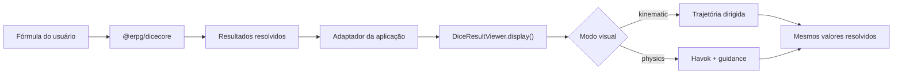
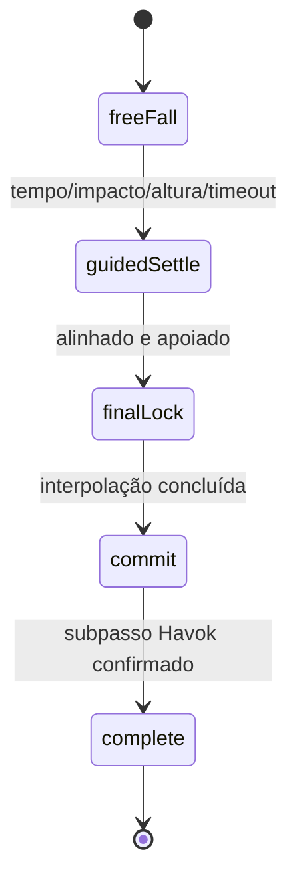

# Devlog — construção da v2

Data da consolidação: **12 de julho de 2026**

Versão documentada: **2.0.3**

## Resumo

A v2 transformou `@erpg/dice3dview` em uma camada de apresentação 3D TypeScript-first, com uma responsabilidade única: mostrar valores que outra biblioteca já resolveu.

A regra arquitetural que guiou todas as decisões foi:

> `@erpg/dicecore` decide; `@erpg/dice3dview` apresenta.

Essa separação foi formalizada no contrato público e a infraestrutura herdada de “roll” saiu do renderer. Isso abriu espaço para um modo cinemático leve e tornou possível adicionar o d2 como uma moeda nativa sem reintroduzir um sistema de rolagem paralelo.

O resultado final reduziu o `dist` em aproximadamente 51%, removeu mundos e builds duplicados, adicionou tipos estritos e manteve uma física opcional capaz de aterrissar exatamente na face recebida.

## Onde começamos

A v1.0.6 já recebia resultados externos por `displayRoll()`, mas ainda carregava a arquitetura herdada do projeto original:

- fachada `WorldFacade` e API `displayRoll()`;
- termos e estruturas de “roll”, incluindo `rollCollectionData`;
- mundos `onscreen`, `offscreen` e `none`;
- worker OffscreenCanvas;
- builds paralelos minificado e não minificado;
- `forcedResultMode: "physics" | "visual"`;
- dependência de `@babylonjs/materials`;
- 15.955.179 bytes em artefatos Git dentro de `dist`;
- ausência de d2 nativo e declarações TypeScript públicas.

O commit `7462f2c`, de maio de 2026, já continha uma boa pesquisa de física guiada: perfis por geometria, motor angular, massas e trava final. Essa parte não foi inventada novamente na v2.0.1; os parâmetros foram auditados, tipados e portados para o novo pipeline.

## Invariantes da nova arquitetura

Antes de reescrever o código, foram definidos cinco invariantes:

1. `value` nunca é sorteado ou recalculado pelo viewer.
2. A face superior nunca volta a ser fonte de verdade.
3. `seed` influencia somente trajetória, posição e rotação visual.
4. Uma falha gráfica não pode produzir um novo resultado.
5. O modo padrão não pode carregar Havok.

O fluxo de responsabilidade ficou assim:



O adaptador permanece na aplicação porque é ali que vivem regras específicas como d3 temporariamente representado por d6, limite visual, temas do usuário e estado `discarded`.

## Fase 1 — API TypeScript estrita

A base foi migrada para TypeScript com:

- `strict`;
- `noUncheckedIndexedAccess`;
- `exactOptionalPropertyTypes`;
- `isolatedModules`;
- `verbatimModuleSyntax`.

A nova fachada é `DiceResultViewer`:

```ts
const viewer = new DiceResultViewer(options)

await viewer.init()
await viewer.display(request)
viewer.clear()
await viewer.updateOptions(nextOptions)
viewer.resize()
viewer.dispose()
```

`display()` normaliza e congela uma cópia do request. O valor continua idêntico ao recebido, mas o retorno não compartilha os mesmos objetos por referência.

Cancelamento também virou parte explícita do contrato. Uma apresentação substituída rejeita com `DisplayCancelledError` e o código estável `DISPLAY_CANCELLED`.

## Fase 2 — dois renderers, uma única fachada

O antigo conjunto de mundos foi substituído pela interface interna `DisplayRenderer` e duas implementações.

### Cinemático

O `KinematicRenderer` é o padrão. Ele:

- não depende de Havok;
- usa arco e giros dirigidos;
- parte alternadamente das laterais;
- espalha os objetos com ângulo áureo, jitter e seed;
- interpola para o quaternion exato da face recebida;
- para o render loop no fim da apresentação.

A primeira implementação da v2 terminava em uma grade. Durante a integração ficou claro que isso parecia uma tela de inventário, não dados que tinham acabado de rolar. A grade foi substituída por dispersão determinística natural.

O lançamento também saiu do alto da câmera e foi movido para as laterais. A câmera foi afastada, preservando o enquadramento do chão, para evitar que o dado parecesse enorme no primeiro frame.

### Físico

O `PhysicsRenderer` é importado dinamicamente. Havok e o WASM entram quando o renderer físico é inicializado: durante `init()` se o modo padrão do viewer for `physics`, ou no primeiro `display({ mode: 'physics' })`.

A simulação usa:

- gravidade, velocidade inicial e lançamento lateral;
- piso e quatro paredes calculados a partir do frustum visível e do aspect ratio do canvas;
- subpassos de 90 Hz;
- colliders dedicados dos modelos;
- contato com chão, paredes e outros dados;
- recuperação de corpos fora do volume ou com transform inválido;
- guidance por quaternion e perfis por geometria.

### Barreiras responsivas na v2.0.3

As primeiras releases da v2 mantinham um piso e quatro paredes de tamanho fixo. Isso funcionava no palco usado durante o desenvolvimento, mas deixava os colliders muito além da borda visível em viewers compactos, overlays e telas estreitas. O dado continuava fisicamente contido, porém podia desaparecer da página antes de atingir a parede.

Na v2.0.3, a área útil é derivada da altura, do FOV e do aspect ratio da câmera. `wallPadding` passou a representar o recuo interno dessa área em unidades do palco. Lançamentos e pousos usam os mesmos limites, e o renderer físico reconstrói piso e paredes quando o canvas muda de tamanho.

Um `ResizeObserver` acompanha o container mesmo quando o redimensionamento não dispara `window.resize`. Se uma apresentação estiver ativa, corpos que ficaram fora do novo retângulo são reconduzidos para dentro das barreiras.

## Fase 3 — d2 como moeda

O d2 não ganhou uma nova mesh no arquivo principal. Ele é criado proceduralmente com:

- um cilindro para a borda;
- um disco para a frente;
- um disco para o verso;
- geometria compartilhada por tema e pooling de instâncias.

O mapeamento é fixo:

```text
frente = 1
verso  = 2
```

Temas podem trocar as imagens por cara/coroa, brasões ou símbolos, sem mudar o contrato numérico. Quando não existe configuração de moeda, a arte numérica padrão é usada.

No modo cinemático a moeda recebe arco e múltiplos giros. No modo físico ela participa do mesmo pipeline de guidance e commit dos poliedros.

## Fase 4 — modelos, texturas e materiais

Cada poliedro possui uma mesh visual, um collider e um `colliderFaceMap`. A orientação é pré-calculada a partir das normais dos triângulos associados ao valor solicitado.

Para cada combinação modelo/tipo/valor, o renderer cacheia:

- quaternion alvo;
- altura de apoio após a rotação.

A altura não é mais um número genérico. Os vértices do collider são transformados pelo quaternion alvo, e o menor `y` determina quanto o corpo precisa ficar acima do chão.

### Regressão das texturas

Remover `CustomMaterial` e `@babylonjs/materials` tornou o pacote menor, mas a primeira versão do material padrão não preservou o contrato das texturas do tema. Nessas texturas, o alfa transparente significa “use `themeColor`”, não “esconda esta parte”.

O sintoma foi severo: números apareciam brancos sobre objetos quase invisíveis ou sem a cor esperada.

A correção usou `MaterialPluginBase`, disponível no Babylon Core, para recompor cor e máscara alfa sem trazer `@babylonjs/materials` de volta. Também foram corrigidas as orientações de diffuse, normal e specular.

Outra correção importante foi tornar a escala de meshes retiradas do pool absoluta. Antes, cada reutilização podia multiplicar a escala anterior.

## Fase 5 — o problema mais difícil: resultado físico divergente

Depois da v2.0.0, o card podia mostrar um valor enquanto o dado parecia terminar em outra face.

A primeira suspeita foi o mapa de faces. Foram auditadas matematicamente todas as 60 faces nativas do modelo padrão — d4, d6, d8, d10, d12 e d20. Os mapas, normais e quaternions canônicos estavam corretos.

O problema real era sincronização:

1. o renderer aplicava `Slerp` diretamente no node visual;
2. o corpo ainda era `DYNAMIC` e controlado por Havok;
3. no mesmo frame, Havok sincronizava sua rotação de volta para o node;
4. a correção visual era sobrescrita;
5. o snap final acontecia tarde e podia parecer desconectado da rolagem.

A solução foi mover toda a correção para o corpo físico.



### `freeFall`

O objeto recebe velocidade inicial e gira livremente. Um viés inicial pequeno evita trajetórias impossíveis sem revelar visualmente o resultado.

### `guidedSettle`

Depois do tempo mínimo e dos critérios de contato, um motor angular calcula o arco quaternion mais curto e aplica velocidade angular ao corpo. Amortecimento cresce durante a acomodação.

### `finalLock`

Quando o corpo está baixo, apoiado, sem colisão recente com outro dado e dentro da tolerância angular, ele muda para `ANIMATED`. Durante 140 ms, `setTargetTransform()` conduz a orientação final suavemente.

### `commit`

Velocidades são zeradas, a transformação exata é enviada ao Havok com prestep de teleporte e a implementação aguarda um `onAfterPhysicsObservable` real.

### `complete`

Somente depois da confirmação o corpo vira `STATIC` e a apresentação pode terminar.

Esse processo garante a face recebida sem consultar a cena como autoridade.

## Perfis pré-calculados

Os parâmetros históricos foram tipados e preservados:

| Dado | Início mínimo | Guia forçado | Duração guia | Força angular | Velocidade máx. | Massa base |
|---|---:|---:|---:|---:|---:|---:|
| d2 | 450 ms | 1120 ms | 920 ms | 4,2 | 5,2 | ×0,70 |
| d4 | 580 ms | 1500 ms | 1240 ms | 4,6 | 5,5 | ×0,82 |
| d6 | 540 ms | 1400 ms | 1160 ms | 5,1 | 6,1 | ×1,00 |
| d8 | 500 ms | 1320 ms | 1080 ms | 5,8 | 7,0 | ×0,92 |
| d10 | 500 ms | 1300 ms | 1040 ms | 6,0 | 7,2 | ×0,88 |
| d12 | 500 ms | 1320 ms | 1080 ms | 5,8 | 7,0 | ×1,08 |
| d20 | 460 ms | 1220 ms | 980 ms | 6,6 | 7,8 | ×1,18 |
| d100 | 500 ms | 1300 ms | 1040 ms | 6,0 | 7,2 | ×0,88 |

Parâmetros comuns incluem ao menos um impacto, 130 ms de graça para quique, tolerância angular de 0,04 radiano e trava final de 140 ms.

## Cache, pools e descarte

A v2 reutiliza:

- configurações de tema;
- modelos carregados e templates de mesh parseados;
- materiais por tema/cor/estado;
- quaternions e alturas de apoio;
- meshes poliedrais;
- raízes de moeda.

Corpos físicos continuam sendo criados por apresentação e descartados ao limpar. Isso evita manter objetos Havok associados a nodes que voltaram ao pool.

`dispose()` para loops, remove observers/listeners e libera cena, engine, materiais, texturas, meshes e corpos.

## Empacotamento

A distribuição passou a ter:

- um único entrypoint ESM;
- chunks lazy;
- declarações TypeScript agregadas;
- física em chunk separado;
- WASM emitido como asset;
- CSS público estável a partir da 2.0.2;
- nenhum build paralelo `.min.js`;
- nenhuma dependência de `@babylonjs/materials`.

O verificador de bundle falha quando:

- o total ultrapassa 8 MiB;
- o grafo cinemático contém referências ao Havok;
- o WASM esperado não foi emitido.

## Métricas

| Versão | `dist` | Pacote `.tgz` | Descompactado | Testes |
|---|---:|---:|---:|---:|
| v1.0.6 | 15.955.179 B | 4.396.834 B | 16.098.720 B | 6 |
| v2.0.0 | 7.803.079 B | 2.305.714 B | 7.868.059 B | 8 |
| v2.0.1 | 7.817.051 B | 2.307.233 B | 7.823.123 B | 33 |
| v2.0.2 | 7.817.960 B no build local | ≈2,32 MB | ≈7,87 MB | 33 |

Da v1.0.6 para a v2.0.1:

- `dist`: −51,01%;
- pacote compactado: −47,53%;
- pacote descompactado: −51,41%.

Os números de `dist` da tabela histórica usam blobs Git; o valor da v2.0.2 é a medição do build local e inclui o CSS estável.

## Estratégia de testes

A suíte cresceu de 6 para 33 testes e cobre:

- validação e imutabilidade de requests;
- d2 valores 1/2 e orientação frente/verso;
- random visual determinístico;
- dispersão final e lançamentos laterais;
- bounds físicos e recuperação de quedas;
- perfis e critérios da máquina de estados;
- arco quaternion mais curto e motor angular;
- todas as 60 faces poliedrais nativas do modelo padrão;
- altura de apoio por orientação;
- preservação da face depois de yaw global.

Além da suíte, a integração local confirmou visualmente:

- d20 simples;
- quatro d6 simultâneos;
- três d20 simultâneos;
- d100 com dezenas e unidades;
- face correta já durante a acomodação, antes do timeout final.

Ainda não existe um teste E2E visual versionado no navegador; isso permanece como próximo passo.

## Regressões que a integração ajudou a encontrar

A v2 não ficou pronta apenas com a reescrita. O frontend revelou problemas que testes unitários isolados não mostraram:

- perda da composição de cor e textura;
- UV/orientação de textura incompatível;
- grade artificial de repouso;
- lançamento alto e grande perto da câmera;
- chão físico menor que o plano visual;
- corpos atravessando o piso;
- correção de rotação visual sobrescrita pelo Havok;
- altura de apoio incorreta;
- lock tardio com sensação de snap.

Registrar essas regressões faz parte do devlog porque elas explicam por que a 2.0.1 concentrou estabilização física e visual poucas horas depois da 2.0.0.

## Limitações conhecidas

- não há d3 nativo;
- d100 consome dois corpos visuais;
- o WASM acompanha a distribuição, embora só seja carregado em `physics`;
- `spawnSpacing` e `spawnHeightStep` estão tipados sem efeito atual;
- `ThemeConfig.extends` e `specularPower` ainda não são processados;
- `diceAvailable` é validado no JSON, mas a disponibilidade real depende do modelo;
- corpos físicos não participam de pool;
- alterar certas opções de engine exige recriar o viewer;
- ainda não existe publicação no registry público npm;
- v2.0.0, v2.0.1, v2.0.2 e v2.0.3 passam a ter tags formais de release.

## Próximos passos

1. adicionar teste E2E visual automatizado com leitura matemática da face final;
2. reduzir o chunk físico e medir transferência comprimida em produção;
3. adicionar degradação automática de sombras para 20/120 corpos;
4. medir memória e descarte em sequências longas de apresentações;
5. avaliar d3 nativo;
6. implementar ou remover opções reservadas sem efeito;
7. manter releases tagueados e, quando apropriado, publicar o pacote no npm.

## Encerramento

A mudança mais importante da v2 não foi visual. Foi definir uma fronteira confiável: a matemática pertence ao `dicecore`; a apresentação pertence ao `dice3dview`.

Essa fronteira permite melhorar animação, física, temas e desempenho sem colocar em risco o resultado que a aplicação já resolveu.
