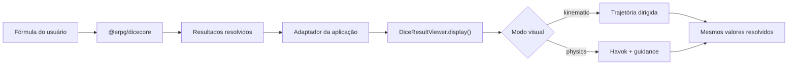
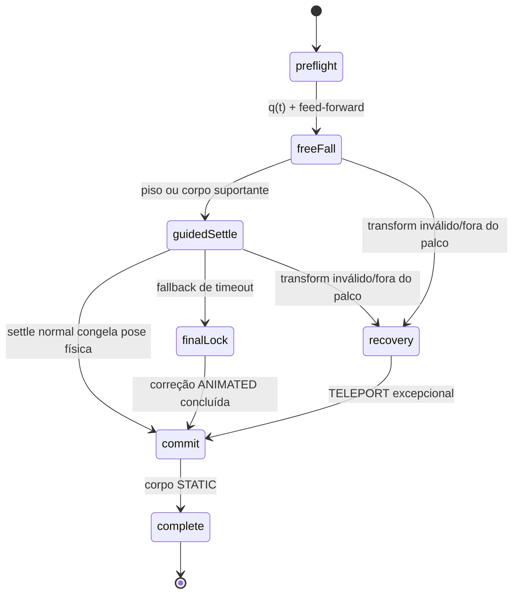

# Devlog — construção da v2

Data da consolidação: **12 de julho de 2026**

Versão documentada: **2.0.4**

## Resumo

A v2 transformou `@erpg/dice3dview` em uma camada de apresentação 3D TypeScript-first, com uma responsabilidade única: mostrar valores que outra biblioteca já resolveu.

A regra arquitetural que guiou todas as decisões foi:

> `@erpg/dicecore` decide; `@erpg/dice3dview` apresenta.

Essa separação foi formalizada no contrato público e a infraestrutura herdada de “roll” saiu do renderer. Isso abriu espaço para um modo cinemático leve e tornou possível adicionar o d2 como uma moeda nativa sem reintroduzir um sistema de rolagem paralelo.

O resultado final reduziu o `dist` em aproximadamente 51%, removeu mundos e builds duplicados, adicionou tipos estritos e manteve uma física opcional capaz de aterrissar exatamente na face recebida.

## Onde começamos

A v1.0.6 já recebia resultados externos por `displayRoll()`, mas ainda carregava a arquitetura herdada do projeto original:

- fachada `WorldFacade` e API `displayRoll()`;
- termos e estruturas de “roll”, incluindo `rollCollectionData`;
- mundos `onscreen`, `offscreen` e `none`;
- worker OffscreenCanvas;
- builds paralelos minificado e não minificado;
- `forcedResultMode: "physics" | "visual"`;
- dependência de `@babylonjs/materials`;
- 15.955.179 bytes em artefatos Git dentro de `dist`;
- ausência de d2 nativo e declarações TypeScript públicas.

O commit `7462f2c`, de maio de 2026, já continha uma boa pesquisa de física guiada: perfis por geometria, motor angular, massas e trava final. Essa parte não foi inventada novamente na v2.0.1; os parâmetros foram auditados, tipados e portados para o novo pipeline. Para recuperar especificamente o gesto de entrada, a comparação posterior usou o pacote v1.0.6 no commit publicado `81c2ca9` como baseline reproduzível.

## Invariantes da nova arquitetura

Antes de reescrever o código, foram definidos cinco invariantes:

1. `value` nunca é sorteado ou recalculado pelo viewer.
2. A face superior nunca volta a ser fonte de verdade.
3. `seed` influencia somente trajetória, posição e rotação visual.
4. Uma falha gráfica não pode produzir um novo resultado.
5. O modo padrão não pode carregar Havok.

O fluxo de responsabilidade ficou assim:



O adaptador permanece na aplicação porque é ali que vivem regras específicas como d3 temporariamente representado por d6, limite visual, temas do usuário e estado `discarded`.

## Fase 1 — API TypeScript estrita

A base foi migrada para TypeScript com:

- `strict`;
- `noUncheckedIndexedAccess`;
- `exactOptionalPropertyTypes`;
- `isolatedModules`;
- `verbatimModuleSyntax`.

A nova fachada é `DiceResultViewer`:

```ts
const viewer = new DiceResultViewer(options)

await viewer.init()
await viewer.display(request)
viewer.clear()
await viewer.updateOptions(nextOptions)
viewer.resize()
viewer.dispose()
```

`display()` normaliza e congela uma cópia do request. O valor continua idêntico ao recebido, mas o retorno não compartilha os mesmos objetos por referência.

Cancelamento também virou parte explícita do contrato. Uma apresentação substituída rejeita com `DisplayCancelledError` e o código estável `DISPLAY_CANCELLED`.

## Fase 2 — dois renderers, uma única fachada

O antigo conjunto de mundos foi substituído pela interface interna `DisplayRenderer` e duas implementações.

### Cinemático

O `KinematicRenderer` é o padrão. Ele:

- não depende de Havok;
- usa arco e giros dirigidos;
- trata cada apresentação como um único arremesso, partindo de uma extremidade comum escolhida pela `seed`;
- espalha os objetos com ângulo áureo, jitter e seed;
- interpola para o quaternion exato da face recebida;
- para o render loop no fim da apresentação.

A primeira implementação da v2 terminava em uma grade. Durante a integração ficou claro que isso parecia uma tela de inventário, não dados que tinham acabado de rolar. A grade foi substituída por dispersão determinística natural.

O lançamento também saiu do alto da câmera e foi movido para as bordas. Cada apresentação escolhe pela `seed` uma borda comum entre esquerda, direita, topo e baixo, independentemente do aspect ratio. Todos os vetores permanecem dentro de um cone de 45 graus para dentro e variam continuamente em energia e direção, com jitter por corpo apenas suficiente para o grupo não parecer rígido. A câmera foi afastada, preservando o enquadramento do chão, para evitar que o dado parecesse enorme no primeiro frame.

Na calibração final, `delay` passou a liberar cada entrada sequencialmente nos dois renderers, com default de 10 ms. Enquanto esperam, nodes cinemáticos e corpos físicos ficam invisíveis. `spawnSpacing: 1.72` entra em um packing que também considera o raio real e a escala: lanes tangenciais são ocupadas sem sobreposição, até duas rows ficam recuadas atrás da borda recortada e, quando a capacidade se esgota, novas waves aguardam a anterior desocupar o portal antes de reutilizar os slots. Isso mantém uma única borda e um único caráter de lançamento mesmo em grupos grandes.

A altura de entrada também deixou de ser parcialmente aleatória. Antes, `startingHeight` funcionava como um teto sobre uma altura calculada perto do objeto, fazendo o lançamento partir mais baixo do que a configuração sugeria. Agora ele é o plano real e fixo de liberação e seu default foi elevado para `7.6`. O default de `spawnHeightStep` continua `0`, então o grupo inteiro compartilha `y = 7.6`; offsets positivos continuam disponíveis de forma explícita. Depois de aplicar o offset, o renderer limita a altura efetiva a `2.8–8.1`, faixa que evita tanto uma entrada rente ao piso quanto distorção excessiva perto da câmera.

O settle cinemático também foi empurrado para o fim. Durante os primeiros 84% da trajetória, o node usa somente o giro seedado; a interpolação para a face recebida começa nos 16% finais. Isso evita que a orientação resolvida domine a queda antes de o objeto chegar ao pouso, sem alterar o resultado determinístico.

### Físico

O `PhysicsRenderer` é importado dinamicamente. Havok e o WASM entram quando o renderer físico é inicializado: durante `init()` se o modo padrão do viewer for `physics`, ou no primeiro `display({ mode: 'physics' })`.

A simulação usa:

- gravidade, velocidade inicial e lançamento lateral;
- kick linear descendente e torque de rolagem pré-calculados antes da liberação;
- piso e quatro paredes calculados a partir do frustum visível e do aspect ratio do canvas;
- subpassos de 90 Hz;
- colliders dedicados dos modelos;
- contato com chão, paredes e outros dados;
- recuperação de corpos fora do volume ou com transform inválido;
- preflight orientado ao resultado e trajetória quaternion `q(t)`;
- guidance por quaternion e perfis por geometria.

### Barreiras responsivas na v2.0.3

As primeiras releases da v2 mantinham um piso e quatro paredes de tamanho fixo. Isso funcionava no palco usado durante o desenvolvimento, mas deixava os colliders muito além da borda visível em viewers compactos, overlays e telas estreitas. O dado continuava fisicamente contido, porém podia desaparecer da página antes de atingir a parede.

Na v2.0.3, a área útil é derivada da altura, do FOV e do aspect ratio da câmera. `wallPadding` passou a representar o recuo interno dessa área em unidades do palco. Lançamentos e pousos usam os mesmos limites, e o renderer físico reconstrói piso e paredes quando o canvas muda de tamanho.

Um `ResizeObserver` acompanha o container mesmo quando o redimensionamento não dispara `window.resize`. Se uma apresentação estiver ativa, corpos que ficaram fora do novo retângulo são reconduzidos para dentro das barreiras.

### Limites finos e colisão lateral viva na v2.0.4

Na calibração seguinte, a contenção estava correta, mas o recuo de `1.35` unidades fazia a colisão parecer acontecer longe demais da extremidade visível. A parede também compartilhava o comportamento dissipativo esperado do piso. O resultado era a percepção de uma barreira grossa e pegajosa, que consumia cedo o impulso do arremesso.

O default de `wallPadding` foi reduzido para `0.25`. Cada parede agora possui collider invisível de `0.25` unidade que cresce para fora, mantendo sua face interna exatamente no limite calculado. O material lateral é independente e, na calibração agressiva, passou a fricção `0.10` e restituição `0.54`; o piso continua usando as opções públicas, cujos defaults são fricção `0.54` e restituição `0.29`.

Essa separação mantém o dado dentro da página, aproxima uma eventual colisão da borda percebida e conserva energia tangencial suficiente para uma resposta lateral visível quando o vetor realmente alcança a parede.

### Spawn fora da projeção e portal de entrada na v2.0.4

Mesmo com o impulso lateral, habilitar o mesh já dentro do recorte ainda fazia o primeiro frame parecer um surgimento. O ponto inicial passou então a ser calculado no plano fixo da altura de lançamento, além da projeção da câmera. Um raio completo mantém o corpo oculto e `spawnOverscan: 0.15` acrescenta mais 15% do raio como margem contra recorte parcial, jitter e diferenças entre geometrias.

Isso criou um conflito específico no renderer físico: dependendo do FOV e da altura, o spawn também podia ficar atrás da barreira correspondente. A solução inicial zerava toda a máscara durante a entrada, mas isso também desligava colisões entre corpos liberados na mesma wave. A versão final separa membership em `DICE`, `FLOOR` e um bit exclusivo para cada parede. Ao se tornar `DYNAMIC`, o dado já colide com outros dados, com o piso e com as três paredes que não são a origem; somente o bit da parede-portal fica ausente. Depois que o collider inteiro cruza a face interna, esse último bit é restaurado.

O kick foi reforçado novamente: `throwForce` passou de `5.15` para `6.4`. A velocidade horizontal base usa coeficiente `0.22` e cap `17.5`; depois da variação de energia da apresentação e do pequeno fator por corpo, o cap final é `19.5`. Forças maiores aumentam o alcance projetado.

`aggressiveThrowChance: 0.12` escolhe uma vez por apresentação apenas se o grupo usa a cauda de maior energia e envelope direcional. Aim e landing continuam dentro das barreiras. A direção nasce de um vetor contínuo; 75–93% das trajetórias projetadas no teste permanecem diretas, enquanto as demais podem alcançar a região de uma parede adjacente, da oposta ou de um canto. Isso não representa contato programado: somente o Havok decide se e onde a colisão acontece. `wallBounceChance` foi mantido como alias deprecated, sem garantia associada ao nome antigo. O preset físico do frontend local foi sincronizado com `startingHeight: 7.6`, `throwForce: 6.4`, `spawnSpacing: 1.72`, `aggressiveThrowChance: 0.12` e `spawnOverscan: 0.15`.

## Fase 3 — d2 como moeda

O d2 não ganhou uma nova mesh no arquivo principal. Ele é criado proceduralmente com:

- um cilindro para a borda;
- um disco para a frente;
- um disco para o verso;
- geometria compartilhada por tema e pooling de instâncias.

O mapeamento é fixo:

```text
frente / normal local +Y = 1 (Identity)
verso  / normal local -Y = 2 (rotação π)
```

Temas podem trocar as imagens por cara/coroa, brasões ou símbolos, sem mudar o contrato numérico. Quando não existe configuração de moeda, a arte numérica padrão é usada.

A inspeção visual encontrou uma inversão desse referencial durante a estabilização da 2.0.4. O mapeamento acima foi restaurado e a rolagem `1d2[2]` confirmou a textura do valor 2 no verso.

No modo cinemático a moeda recebe arco e múltiplos giros. No modo físico ela participa do mesmo pipeline de guidance e commit dos poliedros.

## Fase 4 — modelos, texturas e materiais

Cada poliedro possui uma mesh visual, um collider e um `colliderFaceMap`. A orientação é pré-calculada a partir das normais dos triângulos associados ao valor solicitado.

Para cada combinação modelo/tipo/valor, o renderer cacheia:

- quaternion alvo;
- altura de apoio após a rotação.

A altura não é mais um número genérico. Os vértices do collider são transformados pelo quaternion alvo, e o menor `y` determina quanto o corpo precisa ficar acima do chão.

### Regressão das texturas

Remover `CustomMaterial` e `@babylonjs/materials` tornou o pacote menor, mas a primeira versão do material padrão não preservou o contrato das texturas do tema. Nessas texturas, o alfa transparente significa “use `themeColor`”, não “esconda esta parte”.

O sintoma foi severo: números apareciam brancos sobre objetos quase invisíveis ou sem a cor esperada.

A correção usou `MaterialPluginBase`, disponível no Babylon Core, para recompor cor e máscara alfa sem trazer `@babylonjs/materials` de volta. Também foram corrigidas as orientações de diffuse, normal e specular.

Outra correção importante foi tornar a escala de meshes retiradas do pool absoluta. Antes, cada reutilização podia multiplicar a escala anterior.

## Fase 5 — o problema mais difícil: resultado físico divergente

Depois da v2.0.0, o card podia mostrar um valor enquanto o dado parecia terminar em outra face. A v2.0.1 resolveu a primeira causa: um `Slerp` aplicado somente ao node visual era sobrescrito pelo corpo `DYNAMIC` no mesmo frame. Toda correção passou então para o Havok.

A integração posterior revelou uma segunda causa. A pose inicial era calculada supondo velocidade angular constante, mas `angularDamping` já atuava durante o voo. Mesmo sem colisões, isso invalidava o ângulo pré-calculado antes do primeiro contato. O motor também perseguia a pose final em vez de acompanhar a pose que deveria existir naquele instante, quebrando a própria solução antecipada. Se o primeiro impacto ainda ocorresse com tilt alto, a geometria podia tombar para a face vizinha e só o timeout esconderia o desvio.

### Preflight result-aware da v2.0.4

A v2.0.4 trata o valor recebido como informação de coreografia desde o início, nunca como resultado a calcular:

1. resolve a normal local da face e a altura de apoio pelo collider;
2. cria o kick linear imediato e converte o torque excêntrico em velocidade angular determinística;
3. estima a duração balística até o primeiro contato e projeta a viagem horizontal como `velocity × ETA`;
4. calcula uma pose inicial que já inclui o tumble coerente com esse vetor e completa o giro planejado exatamente na face solicitada;
5. reproduz uma trajetória quaternion `q(t)` em plateau até 72%, com desaceleração tardia cuja integral exata preserva o ângulo do preflight;
6. acompanha essa trajetória com velocidade angular feed-forward;
7. limita a velocidade vertical descendente e converge `x/z` no pouso disperso perto do contato.

#### Auditoria e tradução do lançamento da v1

A revisão do pacote v1.0.6 (`81c2ca9`) mostrou que a sensação de aceleração não vinha de um easing ou de força crescente. O corpo recebia imediatamente um kick descendente e um impulso fora do centro; a gravidade aumentava a velocidade vertical depois da soltura, enquanto o braço excêntrico convertia parte do impulso em tumble. A auditoria instrumentada encontrou velocidades angulares instantâneas entre aproximadamente `40` e `100 rad/s`. Essas magnitudes faziam sentido no pipeline antigo, mas se mostraram instáveis quando aplicadas diretamente ao corpo Havok atual.

Na v2, `createThrownLinearVelocity` reproduz essa soltura instantânea e mantém o destino result-aware. A calibração atual usa `startingHeight: 7.6`, `throwForce: 6.4`, coeficiente horizontal base `0.22`, cap base `17.5` e cap final `19.5`. O corpo começa totalmente fora da projeção e atravessa a borda com um vetor contínuo derivado do landing interno, da energia da apresentação e de pequenas variações por corpo.

O antigo torque excêntrico ainda fornece o sinal e a tendência do eixo, mas `getVisibleFlightAngularVelocity` converte esse vetor em um plano de tumble estável. Com `spinForce: 5.8`, ele programa `2,35` voltas para os demais poliedros, `2,45` para o d20 e `2,5` para o d2. A velocidade angular média é limitada a `20 rad/s` nos poliedros e `22 rad/s` na moeda, portanto uma duração balística curta não recria silenciosamente os picos da v1.

O eixo principal é o eixo de rolagem horizontal, transversal à direção da viagem. Pequenas parcelas seedadas ao longo da viagem e em torno do eixo vertical conservam variedade sem transformar o movimento em giro de pião. As quantidades de voltas não são inteiras de propósito: como o preflight volta do alvo para calcular a pose inicial, um número inteiro poderia colocar a face resolvida para cima nas duas pontas. Com `2,35`, `2,45` ou `2,5` voltas, a face começa claramente afastada do topo e só chega ao resultado ao fim do plano.

Para progresso normalizado `p`, a velocidade permanece em plateau até `p = 0,72`. Nos 28% finais ela desacelera por `smoothStep`, conservando no contato apenas a retenção permitida pelo perfil e pelo cap global de `2,6 rad/s`. O controller integra analiticamente esse trecho — a primitiva normalizada do `smoothStep` usa `t³ − t⁴/2` — e aplica o mesmo fator ao preflight. Assim, a integral total continua exatamente igual ao ângulo usado para criar a pose inicial, mesmo com a desaceleração tardia.

O alvo do primeiro contato também recebe uma inclinação pequena na direção do deslocamento. Em vez de pousar matematicamente plano, o dado encosta de forma controlada por uma aresta ou canto, sem colocar a face vizinha no topo. Esse contato assimétrico converte parte do impulso horizontal em rolagem visível.

O controller compara a orientação física com a pose móvel planejada. A velocidade residual é decomposta em:

- **twist/yaw**, paralelo à normal da face, preservado para manter naturalidade;
- **tilt perturbador**, ortogonal à normal, corrigido com aceleração limitada por subpasso.

`angularDamping` fica em zero durante esse voo controlado e volta somente após o primeiro impacto real. O `linearDamping` continua independente; antes do contato, o soft landing limita a descida e guia `x/z` para `entry.end`, evitando atravessar o pouso durante o tempo adicional de frenagem. Para não apagar o kick no ar, a convergência conserva ao menos `max(2.2, 40% da velocidade horizontal inicial)`. Depois do primeiro contato com parede, piso ou outro dado, o guidance copia de volta o `x/z` físico em vez de substituir a resposta linear do Havok. O preflight angular deixa de inferir a viagem pelo landing e usa o deslocamento projetado pela velocidade durante o ETA: `(vx × ETA, Δy, vz × ETA)`. Os defaults permanecem gravidade `1.3`, damping linear `0.10` e damping angular `0.08`.



### `freeFall`

O corpo é liberado de uma vez com as velocidades linear e angular planejadas; a gravidade acelera então sua descida. Ele segue a pose `q(t)` e o spin feed-forward. O giro mantém velocidade constante até 72% do voo e desacelera somente no trecho restante, com spin de contato limitado a `2,6 rad/s`. O corpo já colide com outros dados desde a liberação. A cauda agressiva altera apenas energia e direção; uma possível parede ou canto surge da projeção contínua, e o Havok decide o contato. Contatos geram microcorreções angulares acumuladas e limitadas pelo tempo restante, mas preservam a nova resposta linear. A frenagem sintética começa somente em 80% do voo no d2, 83% no d4, 85% no d10/d100, 86% no perfil base e 92% no d20; ela só converge a trajetória horizontal antes do primeiro contato.

### `guidedSettle`

Depois do impacto, o amortecimento angular configurado é habilitado progressivamente. Durante os primeiros 60% da acomodação, uma sustentação de rolagem limitada e decrescente atua sobre o eixo compatível com o deslocamento. Ela nunca substitui uma velocidade maior criada por colisão e desaparece antes do assentamento final. O motor de face continua limitado por velocidade e aceleração máximas; dentro da zona morta natural ele deixa de aplicar torque de tilt. O damping de settle reduz o movimento linear gradualmente sem apagar no contato a resposta lateral ou o impulso de separação. Um contato tardio ou baixo com outro dado também pode atuar como suporte; contato sustentado e estável deixa de bloquear o lock. O timeout não libera os gates normais de ângulo, apoio, velocidade e estabilidade.

### `finalLock`, `commit` e `complete`

Quando o corpo já está baixo, apoiado, estável e a menos de `0,04` radiano da face, o settle normal zera suas velocidades na pose Havok corrente e segue diretamente para `commit`, sem trocar o motion type para `ANIMATED`. Isso nunca ocorre antes da janela mínima do perfil: 1.900 ms para d2, 2.400 ms para d4/d20 e 2.300 ms para os demais. Em `commit`, o corpo é congelado como `STATIC` exatamente onde repousou. Não existe `Slerp`, alinhamento de yaw com a câmera, ajuste de altura, `TELEPORT` ou troca de textura; dados vizinhos não são atravessados, e pilhas continuam com separação e suporte físico. Somente o fallback forçado entra em `finalLock` `ANIMATED`, corrige até a zona segura e conserva uma inclinação residual mínima.

O prestep de teleporte ficou isolado em `recovery`, usado somente quando o corpo escapou do volume visível ou produziu uma transformação não finita. Em qualquer caminho, a cena nunca se torna autoridade do valor: ela apenas confirma visualmente o resultado já recebido.

## Perfis pré-calculados

Os perfis agora combinam os parâmetros históricos com limites explícitos de guidance e pouso. O primeiro conjunto controla tempo e continuidade visual:

O plano de voo anterior ao contato usa `2,5` voltas no d2, `2,45` no d20 e `2,35` nos demais poliedros. Seus caps médios são, respectivamente, `22 rad/s` e `20 rad/s`; independentemente do valor médio, a curva limita o spin planejado no contato a `2,6 rad/s`.

| Dado | Janela de guidance | Giro retido no contato | Inclinação de aproximação | Lock elegível após |
|---|---:|---:|---:|---:|
| d2 | 1.450 ms | 10% | 0,055 rad | 1.900 ms |
| d4 | 1.900 ms | 18% | 0,080 rad | 2.400 ms |
| d6 | 1.850 ms | 28% | 0,120 rad | 2.300 ms |
| d8 | 1.800 ms | 28% | 0,120 rad | 2.300 ms |
| d10 | 1.750 ms | 28% | 0,120 rad | 2.300 ms |
| d12 | 1.800 ms | 28% | 0,120 rad | 2.300 ms |
| d20 | 1.700 ms | 32% | 0,190 rad | 2.400 ms |
| d100 | 1.750 ms | 28% | 0,120 rad | 2.300 ms |

Os demais parâmetros conservam a calibração específica de cada geometria:

| Dado | Início mínimo | Força angular | Aceleração settle máx. | Início do freio | Descida máx. | Massa base |
|---|---:|---:|---:|---:|---:|---:|
| d2 | 450 ms | 4,2 | 12 | 80% | 1,4 | ×0,70 |
| d4 | 580 ms | 4,6 | 18 | 83% | 2,0 | ×0,82 |
| d6 | 540 ms | 7,2 | 32 | 86% | 2,5 | ×1,00 |
| d8 | 500 ms | 7,2 | 32 | 86% | 2,6 | ×0,92 |
| d10 | 500 ms | 8,0 | 36 | 85% | 2,2 | ×0,88 |
| d12 | 500 ms | 7,2 | 32 | 86% | 2,6 | ×1,08 |
| d20 | 460 ms | 8,0 | 36 | 92% | 3,6 | ×1,18 |
| d100 | 500 ms | 8,0 | 36 | 85% | 2,2 | ×0,88 |

Parâmetros comuns incluem ao menos um impacto, 130 ms de graça para quique, tolerância angular de `0,04` radiano e zona morta natural de `0,024` radiano. A estabilidade mínima é de 180 ms no perfil base, 200 ms no d4 e 220 ms na moeda; o d2 usa ainda uma zona morta menor, de `0,018` radiano. A duração `ANIMATED` de pelo menos 220 ms se aplica apenas ao `finalLock` de fallback; o settle normal congela a pose física diretamente.

## Cache, pools e descarte

A v2 reutiliza:

- configurações de tema;
- modelos carregados e templates de mesh parseados;
- materiais por tema/cor/estado;
- quaternions e alturas de apoio;
- meshes poliedrais;
- raízes de moeda.

Corpos físicos continuam sendo criados por apresentação e descartados ao limpar. Isso evita manter objetos Havok associados a nodes que voltaram ao pool.

`dispose()` para loops, remove observers/listeners e libera cena, engine, materiais, texturas, meshes e corpos.

## Empacotamento

A distribuição passou a ter:

- um único entrypoint ESM;
- chunks lazy;
- declarações TypeScript agregadas;
- física em chunk separado;
- WASM emitido como asset;
- CSS público estável a partir da 2.0.2;
- nenhum build paralelo `.min.js`;
- nenhuma dependência de `@babylonjs/materials`.

O verificador de bundle falha quando:

- o total ultrapassa 8 MiB;
- o grafo cinemático contém referências ao Havok;
- o WASM esperado não foi emitido.

## Métricas

| Versão | `dist` | Pacote `.tgz` | Descompactado | Testes |
|---|---:|---:|---:|---:|
| v1.0.6 | 15.955.179 B | 4.396.834 B | 16.098.720 B | 6 |
| v2.0.0 | 7.803.079 B | 2.305.714 B | 7.868.059 B | 8 |
| v2.0.1 | 7.817.051 B | 2.307.233 B | 7.823.123 B | 33 |
| v2.0.2 | 7.817.960 B no build local | ≈2,32 MB | ≈7,87 MB | 33 |
| v2.0.4 | medição de release pendente | medição de release pendente | medição de release pendente | 72 |

Da v1.0.6 para a v2.0.1:

- `dist`: −51,01%;
- pacote compactado: −47,53%;
- pacote descompactado: −51,41%.

Os números de `dist` da tabela histórica usam blobs Git; o valor da v2.0.2 é a medição do build local e inclui o CSS estável.

## Estratégia de testes

A suíte cresceu de 6 para 72 testes em 18 suítes e cobre:

- validação e imutabilidade de requests;
- d2 valores 1/2 e orientação frente/verso;
- random visual determinístico;
- dispersão final e arremessos de grupo por uma das quatro bordas, com spawn completamente fora da projeção;
- cone direcional e impulso para dentro em desktop e retrato com até 120 corpos;
- plano fixo de entrada, `spawnHeightStep: 0` e confinamento de altura a `2.8–8.1`;
- overscan proporcional ao raio e portal seletivo que remove apenas a parede de entrada;
- packing radius-aware sem sobreposição, com lanes, até duas rows e waves temporizadas;
- distribuição contínua de energia/direção, cauda agressiva por apresentação e landing sempre interno;
- envelope projetado com 75–93% de trajetórias diretas e casos de alcance adjacente, oposto e de canto, sem prometer contato;
- camadas `DICE`, `FLOOR` e uma por parede, mantendo colisões dado-dado desde a liberação;
- kick imediato sem ease-in, coeficiente base `0.22`, caps `17.5/19.5`, ETA balístico e liberação sequencial nos dois modos;
- preflight orientado pela viagem `velocity × ETA`;
- bounds físicos e recuperação de quedas;
- perfis e critérios da máquina de estados;
- preflight result-aware, `q(t)` com plateau até 72%, desaceleração final de integral exata e feed-forward angular;
- contagem de voltas, cap de velocidade média e cap de `2,6 rad/s` no contato;
- rotação acumulada do quaternion e viagem acumulada da normal da face durante todo o voo;
- afastamento da face resolvida no frame inicial e confirmação do mesmo resultado no repouso final;
- preservação de twist/yaw e remoção limitada de tilt perturbador;
- cone seguro de face, zona morta natural e fallback com inclinação residual;
- soft landing vertical por perfil;
- arco quaternion mais curto e motor angular pós-impacto;
- todas as 60 faces poliedrais nativas do modelo padrão;
- altura de apoio por orientação;
- preservação da face depois de yaw global;
- convergência pura a 90 Hz em 48 combinações de perfil e pose de face;
- Havok real em voo, contato e piso de alta fricção;
- retenção de giro no contato, aproximação inclinada segura e movimento pós-impacto prolongado;
- preservação da resposta linear depois de contatos com parede, piso ou outro dado;
- colisões entre múltiplos corpos e stacking sem interpenetração após o settle normal;
- espessura, face interna e resposta oblíqua das quatro barreiras com material independente em impactos de até 18 unidades por segundo.

O collider d20 serializado do tema padrão conserva uma matriz de compatibilidade com a calibração anterior fixa (`startingHeight: 6.4`, `throwForce: 5.15`). Os valores `1`, `4`, `7`, `10`, `13` e `20` chegaram ao primeiro contato entre `0.7–0.95` segundo e dentro da tolerância, respeitaram o limite vertical e repousaram com a mesma face visível: 6 de 6 aprovados. A calibração atual é coberta separadamente pelos testes de packing, impulso, distribuição de direção/energia e colisões múltiplas descritos acima.

Além da suíte, a integração local confirmou visualmente:

- d20 simples;
- quatro d6 simultâneos;
- três d20 simultâneos;
- d100 com dezenas e unidades;
- d2 valor 2 com a textura correta do verso;
- face correta já durante a acomodação, antes do timeout final.

Ainda não existe um teste E2E visual versionado no navegador; isso permanece como próximo passo.

## Colisão real em grupos densos

Uma auditoria com 12d6 revelou que as máscaras de colisão estavam corretas, mas o impulso era aplicado antes de o corpo sair de `ALWAYS_INACTIVE`. No Babylon/Havok 7.54.3, essa ativação posterior zerava as velocidades nativas. Os dados perdiam a dispersão planejada, caíam no mesmo corredor e sobrecarregavam o settle.

A sequência foi invertida: o corpo passa a `DYNAMIC`, é ativado e só então recebe velocidades linear e angular. O portal também ganhou admissão por distância, reavaliada a cada subpasso, e o timestep passou a ser adaptativo (`180 Hz` para 2–24 corpos, `120 Hz` acima disso e `90 Hz` para um corpo). Por fim, o fallback animado foi serializado; ele aguarda colisões recentes e retorna o corpo a `DYNAMIC` se tocar um vizinho, evitando congelar interpenetrações como `STATIC`.

As regressões cobrem burst Havok de 12d6 em alta velocidade, quatro pilhas de três dados, ativação com preservação do impulso, admissão sem overlap e ausência de deadlock.

## Regressões que a integração ajudou a encontrar

A v2 não ficou pronta apenas com a reescrita. O frontend revelou problemas que testes unitários isolados não mostraram:

- perda da composição de cor e textura;
- UV/orientação de textura incompatível;
- grade artificial de repouso;
- lançamento alto e grande perto da câmera;
- chão físico menor que o plano visual;
- corpos atravessando o piso;
- correção de rotação visual sobrescrita pelo Havok;
- altura de apoio incorreta;
- lock tardio com sensação de snap;
- preflight invalidado por damping angular antes do impacto;
- velocidade angular de `40–100 rad/s` herdada literalmente da v1, instável no corpo Havok atual;
- plano com voltas inteiras que podia iniciar com a face resolvida já apontada para cima;
- settle cinemático precoce, que deixava o resultado dominar a orientação durante a queda;
- face correta no ar tombando por excesso de velocidade vertical no primeiro contato;
- dados que perdiam quase todo o movimento imediatamente depois do impacto;
- soft landing que sobrescrevia respostas laterais e impulsos de separação depois do contato;
- portal com máscara zerada que desligava colisões dado-dado durante a entrada;
- commit normal em `ANIMATED` que podia atravessar vizinhos e achatar pilhas;
- lanes sem packing por raio, que permitiam sobreposição em grupos grandes;
- paredes percebidas como grossas e pegajosas por causa do recuo e da fricção anteriores;
- entrada sem kick, tumble ou escalonamento perceptível, que fazia os corpos apenas aparecerem em movimento em vez de parecerem arremessados;
- `startingHeight` usado apenas como teto sobre uma altura aleatória baixa, apesar de a configuração indicar um plano mais alto;
- corpo habilitado já dentro do recorte ou rebatido pela própria parede de lançamento antes de entrar no palco.

Registrar essas regressões faz parte do devlog porque elas explicam por que a 2.0.1 concentrou estabilização física e visual poucas horas depois da 2.0.0.

## Limitações conhecidas

- não há d3 nativo;
- d100 consome dois corpos visuais;
- o WASM acompanha a distribuição, embora só seja carregado em `physics`;
- `ThemeConfig.extends` e `specularPower` ainda não são processados;
- `diceAvailable` é validado no JSON, mas a disponibilidade real depende do modelo;
- corpos físicos não participam de pool;
- alterar certas opções de engine exige recriar o viewer;
- ainda não existe publicação no registry público npm;
- v2.0.0, v2.0.1, v2.0.2, v2.0.3 e v2.0.4 passam a ter tags formais de release.

## Próximos passos

1. adicionar teste E2E visual automatizado com leitura matemática da face final;
2. reduzir o chunk físico e medir transferência comprimida em produção;
3. adicionar degradação automática de sombras para 20/120 corpos;
4. medir memória e descarte em sequências longas de apresentações;
5. avaliar d3 nativo;
6. implementar ou remover propriedades de tema reservadas sem efeito;
7. manter releases tagueados e, quando apropriado, publicar o pacote no npm.

## Encerramento

A mudança mais importante da v2 não foi visual. Foi definir uma fronteira confiável: a matemática pertence ao `dicecore`; a apresentação pertence ao `dice3dview`.

Essa fronteira permite melhorar animação, física, temas e desempenho sem colocar em risco o resultado que a aplicação já resolveu.
